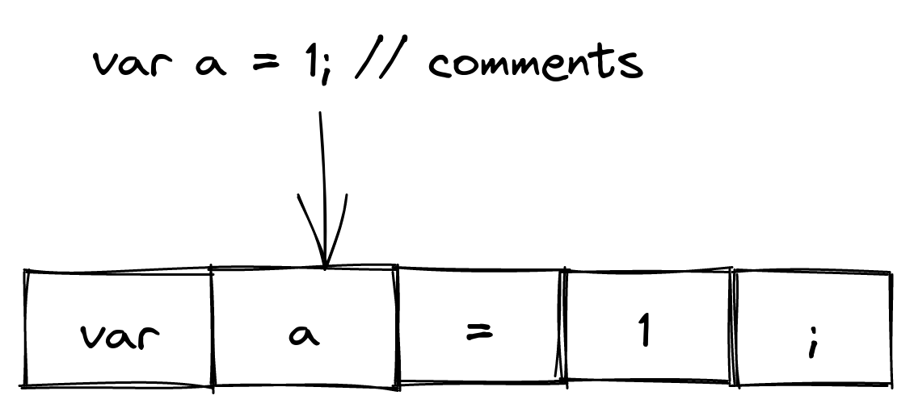
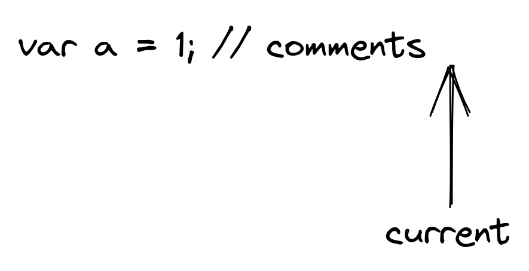
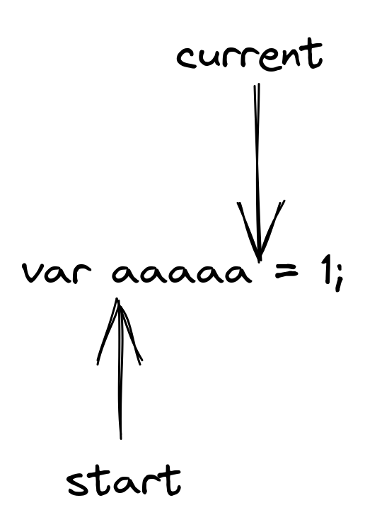

## 第一章 词法分析

创建项目：

```bash
cargo new lox
```

在`src`文件夹下创建`scanner.rs`文件。

词法分析的目的是将源代码字符串转换成词法单元的流或者数组。并忽略掉注释和空白符等无用信息。



首先在文件中定义词法单元的类型。

我们使用枚举类型`enum`。

```rust
//! src/scanner.rs

#[derive(Eq, PartialEq, Debug, Copy, Clone, Hash)]
pub enum TokenType {
    LeftParen,      // `(`
    RightParen,     // `)`
    LeftBrace,      // `{`
    RightBrace,     // `}`
    Comma,          // `,`
    Dot,            // `.`
    Minus,          // `-`
    Plus,           // `+`
    Semicolon,      // `;`
    Slash,          // `/`
    Star,           // `*`
    
    // 单字符或者双字符词法单元
    Bang,           // `!`
    BangEqual,      // `!=`
    Equal,          // `=`
    EqualEqual,     // `==`
    Greater,        // `>`
    GreaterEqual,   // `>=`
    Less,           // `<`
    LessEqual,      // `<=`
    
    Identifier,     // 标识符
    String,         // 字符串
    Number,         // 数值
    
    // 关键字
    And,            // `and`
    Class,          // `class`
    Else,           // `else`
    False,          // `false`
    For,            // `for`
    Fun,            // `fun`
    If,             // `if`
    Nil,            // `nil`
    Or,             // `or`
    Print,          // `print`
    Return,         // `return`
    Super,          // `super`
    This,           // `this`
    True,           // `true`
    Var,            // `var`
    While,          // `while`
    
    Error,
    Eof,            // 文件结束符
}
```

我们这里通过`#[derive]`为`TokenType`提供了一些基础的实现。常用的实现有：

- 比较：`Eq`、`PartialEq`、`Ord`、`PartialOrd`
- `Clone`：从`&T`的一个拷贝创建`T`
- `Copy`：把一个类型的`move`转换成`copy`
- `Hash`：从`&T`计算它的哈希值
- `Default`：创建一个数据类型的空实例
- `Debug`：用`{:?}`格式化一个值

定义好词法单元的类型之后，我们现在可以定义词法单元的结构体类型了。

这里用到了Rust的生命周期注解，我们给注解起名为`'sourcecode`，结构体如果注解了生命周期，那么结构体中的所有**引用**字段都必须注解生命周期。表示`Token`实例的生存的时间不能超过`lexeme`的生存时间。

```rust
//! src/scanner.rs

#[derive(Copy, Clone, Debug)]
pub struct Token<'sourcecode> {
    pub kind: TokenType,           // 词法单元的类型
    pub line: usize,               // 词法单元所处的行号
    pub lexeme: &'sourcecode str,  // 词法单元的字面量值，例如关键字`var`的字面量值是"var"
}
```

定义好词法单元的结构体，我们开始定义词法扫描器的结构体。`'static`表示生命周期为整个程序执行的过程。

```rust
//! src/scanner.rs

pub struct Scanner<'sourcecode> {
    /// key为字符串，`'static`表示生命周期为整个程序执行的过程
    /// value为词法单元的类型
    keywords: HashMap<&'static str, TokenType>,
    /// 源代码字符串
    code: &'sourcecode str,
    /// 扫描到的某个Token的开始位置
    start: usize,
    /// 扫描器所处的当前位置
    current: usize,
    /// 行号
    line: usize,
}
```

定义好`Scanner`结构体之后，我们为这个结构体添加一些方法。

首先添加实例化一个`Scanner`结构体的方法。

在Rust中语句的结尾以分号结尾。如果返回一个表达式，可以不写`return`关键字，且不能以分号结尾。

```rust
//! src/scanner.rs

impl<'sourcecode> Scanner<'sourcecode> {
    pub fn new(code: &'sourcecode str) -> Scanner {
        // 容量为16组kv键值对的哈希表
        let mut keywords = HashMap::with_capacity(16);
        keywords.insert("and", TokenType::And);
        keywords.insert("class", TokenType::Class);
        keywords.insert("else", TokenType::Else);
        keywords.insert("false", TokenType::False);
        keywords.insert("for", TokenType::For);
        keywords.insert("fun", TokenType::Fun);
        keywords.insert("if", TokenType::If);
        keywords.insert("nil", TokenType::Nil);
        keywords.insert("or", TokenType::Or);
        keywords.insert("print", TokenType::Print);
        keywords.insert("return", TokenType::Return);
        keywords.insert("super", TokenType::Super);
        keywords.insert("this", TokenType::This);
        keywords.insert("true", TokenType::True);
        keywords.insert("var", TokenType::Var);
        keywords.insert("while", TokenType::While);
        
        Scanner {
            keywords,
            code,        // 源代码字符串
            start: 0,    // 扫描器的起始位置的初始值是索引0
            current: 0,  // 扫描器的当前位置的初始值是索引0
            line: 1,     // 行号的初始值是1
        }
    }
}
```

接下来在`new`函数的后面添加`scan_token`函数，用来扫描字符串并得到词法单元。

```rust
//! src/scanner.rs

impl<'sourcecode> Scanner<'sourcecode> {
    pub fn new(code: &'sourcecode str) -> Scanner {
        ...
    }
    
    pub fn scan_token(&mut self) -> Token<'sourcecode> {
        // 扫描时跳过空白字符
        self.skip_whitespace();
        // 当扫描一个新的Token时，将扫描器的起始位置设置为当前位置
        self.start = self.current;
        // 如果扫描到了结尾，则返回Eof词法单元
        if self.is_at_end() {
            return self.make_token(TokenType::Eof);
        }
        
        // 获取当前字符，并将扫描器的current前进一个字符，
        // 根据获取的当前字符的值确定返回什么样的词法单元
        match self.advance() {
            b'(' => self.make_token(TokenType::LeftParen),
            b')' => self.make_token(TokenType::RightParen),
            b'{' => self.make_token(TokenType::LeftBrace),
            b'}' => self.make_token(TokenType::RightBrace),
            b';' => self.make_token(TokenType::Semicolon),
            b',' => self.make_token(TokenType::Comma),
            b'.' => self.make_token(TokenType::Dot),
            b'-' => self.make_token(TokenType::Minus),
            b'+' => self.make_token(TokenType::Plus),
            b'/' => self.make_token(TokenType::Slash),
            b'*' => self.make_token(TokenType::Star),
            // 如果current指向的字符是'='，则返回双字符词法单元。
            b'!' if self.matches(b'=') => self.make_token(TokenType::BangEqual),
            b'!' => self.make_token(TokenType::Bang),
            b'=' if self.matches(b'=') => self.make_token(TokenType::EqualEqual),
            b'=' => self.make_token(TokenType::Equal),
            b'<' if self.matches(b'=') => self.make_token(TokenType::LessEqual),
            b'<' => self.make_token(TokenType::Less),
            b'>' if self.matches(b'=') => self.make_token(TokenType::GreaterEqual),
            b'>' => self.make_token(TokenType::Greater),
            b'"' => self.string(),
            c if is_digit(c) => self.number(),
            c if is_alpha(c) => self.identifier(),
            _ => self.error_token("Unexpected character."),
        }
    }
}
```

编写判断是否是文件结尾的功能函数：

如果`current`指向的位置已经超出了字符串，那么扫描可以结束了。



```rust
//! src/scanner.rs

impl<'sourcecode> Scanner<'sourcecode> {
    ...
    ...
    
    pub fn scan_token(&mut self) -> Token<'sourcecode> {
        ...
    }
    
    // 添加以下代码
    fn is_at_end(&self) -> bool {
        self.current == self.code.len()
    }
}
```

编写获取词法单元字面量的功能函数：

将从`start`到`current`（左闭右开区间，也就是不包含`current`指向的字符）的子字符串作为字面量返回。



```rust
//! src/scanner.rs

impl<'sourcecode> Scanner<'sourcecode> {
    ...
    ...
    
    fn is_at_end(&self) -> bool {
        ...
    }
    
    // 添加以下代码
    fn lexeme(&self) -> &'sourcecode str {
        &self.code[self.start..self.current]
    }
}
```

编写实例化一个词法单元的功能函数：

```rust
//! src/scanner.rs

impl<'sourcecode> Scanner<'sourcecode> {
    ...
    ...
    
    fn lexeme(&self) -> &'sourcecode str {
        ...
    }
    
    // 添加以下代码
    fn make_token(&self, kind: TokenType) -> Token<'sourcecode> {
        Token {
            kind,                    // 词法单元类型
            lexeme: self.lexeme(),   // 词法单元的字面量
            line: self.line,         // 词法单元所属的行号
        }
    }
}
```

编写查看当前扫描到的字符的功能函数，返回`current`指向的字符。

```rust
//! src/scanner.rs

impl<'sourcecode> Scanner<'sourcecode> {
    ...
    ...
    
    fn make_token(&self, kind: TokenType) -> Token<'sourcecode> {
        ...
    }
    
    // 添加以下代码
    fn peek(&self) -> u8 {
        if self.is_at_end() {
            0
        } else {
            self.code.as_bytes()[self.current]
        }
    }
}
```

编写查看将要扫描的下一个字符的功能函数：

```rust
//! src/scanner.rs

impl<'sourcecode> Scanner<'sourcecode> {
    ...
    ...
    
    fn peek(&self) -> u8 {
        ...
    }
    
    // 添加以下代码
    fn peek_next(&self) -> u8 {
        if self.current > self.code.len() - 2 {
            b'\0'
        } else {
            self.code.as_bytes()[self.current + 1]
        }
    }
}
```

当遇到非法字符时，进行错误处理。

```rust
//! src/scanner.rs

impl<'sourcecode> Scanner<'sourcecode> {
    ...
    ...
    
    fn peek_next(&self) -> u8 {
        ...
    }
    
    // 添加以下代码
    fn error_token(&self, message: &'static str) -> Token<'static> {
        Token {
            kind: TokenType::Error,
            lexeme: message,
            line: self.line,
        }
    }
}
```

返回当前字符，并向前进一个字符。

```rust
//! src/scanner.rs

impl<'sourcecode> Scanner<'sourcecode> {
    ...
    ...
    
    fn error_token(&self, message: &'static str) -> Token<'static> {
        ...
    }
    
    // 添加以下代码
    fn advance(&mut self) -> u8 {
        let char = self.peek();
        self.current += 1;
        char
    }
}
```

如果当前扫描的字符和预期的字符相匹配，则返回`true`，并向前进一个字符。如果不匹配或者已经扫描完毕，则返回`false`。

```rust
//! src/scanner.rs

impl<'sourcecode> Scanner<'sourcecode> {
    ...
    ...
    
    fn advance(&mut self) -> u8 {
        ...
    }
    
    // 添加以下代码
    fn matches(&mut self, expected: u8) -> bool {
        if self.is_at_end() || self.peek() != expected {
            false
        } else {
            self.current += 1;
            true
        }
    }
}
```

编写跳过空白符和注释的功能函数。

```rust
//! src/scanner.rs

impl<'sourcecode> Scanner<'sourcecode> {
    ...
    ...
    
    fn matches(&mut self, expected: u8) -> bool {
        ...
    }
    
    // 添加以下代码
    fn skip_whitespace(&mut self) {
        while !self.is_at_end() {
            match self.peek() {
                b' ' | b'\r' | b'\t' => {
                    self.advance();
                }
                b'\n' => {
                    self.line += 1; // 碰到换行符，行号加1。
                    self.advance();
                }
                b'/' if self.peek_next() == b'/' => {
                    while self.peek() != b'\n' && !self.is_at_end() {
                        self.advance();
                    }
                }
                _ => return,
            }
        }
    }
}
```

编写识别字符串类型的词法单元的功能函数：

```rust
//! src/scanner.rs

impl<'sourcecode> Scanner<'sourcecode> {
    ...
    ...
    
    fn skip_whitespace(&mut self) {
        ...
    }
    
    // 添加以下代码
    fn string(&mut self) -> Token<'sourcecode> {
        while self.peek() != b'"' && !self.is_at_end() {
            // lox允许字符串换行
            if self.peek() == b'\n' {
                self.line += 1;
            }
            self.advance();
        }
        
        // 如果不是遇到`"`字符退出的while循环，
        // 而是由于文件结束退出的循环，则返回错误词法单元。
        if self.is_at_end() {
            self.error_token("Unterminated string.")
        } else {
            self.advance();
            self.make_token(TokenType::String)
        }
    }
}
```

编写识别数值类型的词法单元的功能函数，如果当前指向的字符一直是数字，则一直向前扫描，如果碰到`.`字符，则说明是一个浮点数，那么继续向前扫描。

```rust
//! src/scanner.rs

impl<'sourcecode> Scanner<'sourcecode> {
    ...
    ...
    
    fn string(&mut self) -> Token<'sourcecode> {
        ...
    }
    
    // 添加以下代码
    fn number(&mut self) -> Token<'sourcecode> {
        while is_digit(self.peek()) {
            self.advance();
        }
        
        // 处理浮点数
        if self.peek() == b'.' && is_digit(self.peek_next()) {
            self.advance();
            while is_digit(self.peek()) {
                self.advance();
            }
        }
        
        self.make_token(TokenType::Number)
    }
}
```

编写识别标识符的词法单元的功能函数，如果`current`指向的一直是字符或者数字，则一直向前扫描。

```rust
//! src/scanner.rs

impl<'sourcecode> Scanner<'sourcecode> {
    ...
    ...
    
    fn number(&mut self) -> Token<'sourcecode> {
        ...
    }
    
    // 添加以下代码
    fn identifier(&mut self) -> Token<'sourcecode> {
        while is_alpha(self.peek()) || is_digit(self.peek()) {
            self.advance();
        }
        self.make_token(self.identifier_type())
    }
}
```

返回标识符的类型，如果不是某个关键字，那么统一识别为标识符类型。

```rust
//! src/scanner.rs

impl<'sourcecode> Scanner<'sourcecode> {
    ...
    ...
    
    fn identifier(&mut self) -> Token<'sourcecode> {
        ...
    }
    
    // 添加以下代码
    fn identifier_type(&self) -> TokenType {
        self.keywords
            .get(self.lexeme())
            .cloned()
            .unwrap_or(TokenType::Identifier)
    }
}
```

编写识别数字字符和字母字符的功能函数：

```rust
//! src/scanner.rs

impl<'sourcecode> Scanner<'sourcecode> {
    ...
}

// 添加以下代码
/// 是否是数字
fn is_digit(c: u8) -> bool {
    c.is_ascii_digit()
}

/// 是否是字母
fn is_alpha(c: u8) -> bool {
    c.is_ascii_alphabetic() || c == b'_'
}
```

创建`src/error.rs`文件。

```rust
//! src/error.rs

/// 错误分为编译期错误和运行时错误
pub enum LoxError {
    CompileError, // 编译期错误
    RuntimeError, // 运行时错误
}
```

编写程序的`src/main.rs`文件如下，用来测试词法分析功能。首先导入依赖。

```rust
//! src/main.rs

mod error;
mod scanner;

use std::env;
use std::fs;
use std::io::{self, Write};
use std::process;

use crate::scanner::Scanner;
use crate::scanner::TokenType;
```

编写`main`函数：

```rust
//! src/main.rs

fn main() {
    // 获取程序的参数列表
    let args: Vec<String> = env::args().collect();
    match args.len() {
        // 如果没有传参，则启动repl
        1 => repl(),
        // 如果传了文件路径作为参数，则作为文件运行
        2 => run_file(&args[1]),
        // 其他情况，报错退出进程
        _ => process::exit(64),
    }
}
```

编写启动repl的代码：

```rust
//! src/main.rs

fn repl() {
    loop {
        print!("> ");
        io::stdout().flush().unwrap();
        let mut line = String::new();
        io::stdin()
            .read_line(&mut line)
            .expect("Unable to read line from the REPL");
        if line.is_empty() {
            break;
        }
        let mut scanner = Scanner::new(&line);
        loop {
            let tok = scanner.scan_token();
            println!("{:?}", &tok);
            if tok.kind == TokenType::Eof {
                break;
            }
        }
    }
}
```

编写直接运行lox代码文件的代码：

```rust
//! src/main.rs

fn run_file(path: &str) {
    let code = match fs::read_to_string(path) {
        Ok(content) => content,
        Err(error) => {
            eprint!("Unable to read file {}: {}", path, error);
            process::exit(74);
        }
    };
    let mut scanner = Scanner::new(&code);
    loop {
        let tok = scanner.scan_token();
        println!("{:?}", &tok);
        if tok.kind == TokenType::Eof {
            break;
        }
    }
}
```

现在我们可以来测试一下编写的词法分析器了。首先编译程序：

```bash
cargo build --release
```

然后执行程序：

```bash
target/release/lox
```

进入到repl界面：

```bash
>var a = 1;
```

回车后会返回对`var a = 1;`的词法分析结果：

```
Token { kind: Var, line: 1, lexeme: "var" }
Token { kind: Identifier, line: 1, lexeme: "a" }
Token { kind: Equal, line: 1, lexeme: "=" }
Token { kind: Number, line: 1, lexeme: "1" }
Token { kind: Semicolon, line: 1, lexeme: ";" }
Token { kind: Eof, line: 2, lexeme: "" }
```

当然也可以创建一个文件`testcases/test.lox`，并写入以下代码：

```
// testcases/test.lox

var a = 1;
```

然后执行：

```bash
target/release/tiger testcases/test.tig
```

会输出下面的结果。我们可以看到，注释被忽略掉了。

```
Token { kind: Var, line: 3, lexeme: "var" }
Token { kind: Identifier, line: 3, lexeme: "a" }
Token { kind: Equal, line: 3, lexeme: "=" }
Token { kind: Number, line: 3, lexeme: "1" }
Token { kind: Semicolon, line: 3, lexeme: ";" }
Token { kind: Eof, line: 3, lexeme: "" }
```

## 第二章 语法分析

